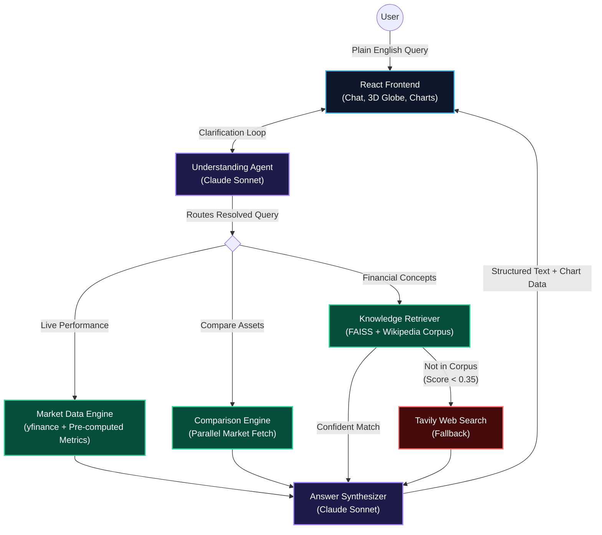

# FinQ — Financial Asset Q&A System

A full-stack conversational AI application that answers natural language questions about stocks, markets, and financial concepts.

---

## What it does

Ask anything in plain English — no need to know ticker symbols or how to phrase queries:

- **"How has Apple performed this month?"** → live price, 7-day/30-day % change, 52-week range, trend analysis, recent headlines, interactive candlestick chart
- **"Compare TSLA and NVDA"** → parallel fetch, side-by-side fundamentals, normalised performance chart
- **"What is dollar cost averaging?"** → Wikipedia-grounded RAG answer with cited sources
- **"Why did SVB collapse?"** → Tavily web search fallback when topic is outside the corpus
- **"Tell me about that EV company from China"** → multi-turn clarification until the query is specific enough to route

---

## Architecture



## Tech Stack

| Layer | Technology |
|-------|-----------|
| Backend | FastAPI + Python 3.12, uvicorn |
| LLM | Claude Sonnet 4.6 (understanding, market, RAG, comparison), Claude Haiku 4.5 (ticker resolver, summarizer) |
| Market data | yfinance 0.2.66 + curl_cffi |
| Vector search | FAISS (IndexFlatIP, 2,108 child vectors across 51 articles) |
| Embeddings | BAAI/bge-m3 (1024-dim, sentence-transformers, MPS) |
| Reranker | BAAI/bge-reranker-v2-m3 (CrossEncoder, MPS) |
| Web search | Tavily (`search_depth=advanced`) |
| Charts | lightweight-charts v5 (TradingView) — candlestick, volume, normalised comparison |
| Frontend | React 18, Vite, Tailwind CSS |
| 3D Globe | React Three Fiber (r3f@8), drei@9, Three.js |
| Animation | Framer Motion |

---

## Project Layout

```
financial-qa/
  backend/
    main.py                    FastAPI app — CORS, structured logging
    agents/
      understanding_agent.py  Multi-turn intake: clarify → resolve → route (Claude Sonnet)
                               Includes context resolution (implicit stock references from history)
      market_agent.py         fetch → compute → news → Claude Sonnet; returns (answer, chart_data)
      comparison_agent.py     Parallel fetch for 2+ tickers → side-by-side analysis + comparison chart
      rag_agent.py            RAG → confidence gate (0.35) → Tavily fallback → Claude Sonnet
    market/
      fetcher.py              yfinance → StockData (price, fundamentals, quarterly earnings, OHLCV)
      calculator.py           Pure-Python metrics → MarketMetrics
      news.py                 yfinance t.news → Yahoo Finance headlines (with URLs for citation)
      web_search.py           Tavily → WebResult list (knowledge fallback only)
      ticker_resolver.py      Company name → validated ticker (Haiku + yfinance)
    rag/
      config.py               Central config: models, thresholds, chunk sizes
      build_corpus.py         Wikipedia fetcher → 51 .md files (5 financial categories)
      embedder.py             bge-m3, MPS-accelerated, lazy singleton
      chunker.py              Parent-child chunker: sections → 100-token children
      indexer.py              FAISS builder + loader, model mismatch detection
      reranker.py             bge-reranker-v2-m3, MPS, graceful fallback
      retriever.py            embed → FAISS → rerank → parent lookup
      data/documents/         51 Wikipedia .md files (committed)
    prompts/
      market_prompt.py        Structured prompt builder (3-section format + news URL citations)
      rag_prompt.py           RAG + web search system prompts + context formatters
      comparison_prompt.py    Side-by-side comparison prompt (4-section format)
    routers/
      chat.py                 POST /api/chat, POST /api/summarize-history
      query.py                POST /api/query (direct, ticker required)
    test_market.py            Data layer smoke test (no LLM)
    test_chat.py              Interactive CLI for the full conversational flow
    test_rag.py               RAG pipeline test (no API key needed)

  frontend/
    src/
      App.jsx                 Root: layout, state, landing <-> chat transition
      index.css               Global styles: animations, dark theme, scrollbar, link styles
      components/
        FinancialGlobe.jsx    R3F scene: animated GLB earth, question chips, OrbitControls
        TickerTape.jsx        Scrolling price ticker (CSS animation)
        ChatMessage.jsx       Message bubbles — user / clarify / answer
        AnswerCard.jsx        Animated section panels from ##-markdown; View Chart toggle; remark-gfm tables
        ChartPanel.jsx        lightweight-charts: candlestick+volume (single), normalised % lines (comparison), SVG earnings bars
        InputBar.jsx          Auto-grow textarea, send button, 16px (iOS-safe)
    public/
      hologram_planet_earth_animated.glb
    vite.config.js            /api proxy + Three.js + lightweight-charts code splitting
    tailwind.config.js
    postcss.config.js

  evaluation/                 Offline evaluation framework
    test_routing.py           Routing accuracy: 40 labeled queries, confusion matrix (requires API key)
    test_retrieval.py         Hit@1/Hit@5/MRR + reranker lift — no API key needed
    test_market_accuracy.py   Data layer math cross-checks — no API key needed
    test_faithfulness.py      Haiku-as-judge: hallucination detection on market answers
    data/
      routing_labels.json     40 labeled queries (market / comparison / knowledge)
      retrieval_labels.json   25 questions with expected source documents
```

---

## Setup

### Prerequisites

- Python 3.12 arm64 (Homebrew: `/opt/homebrew/bin/python3`) — native Apple Silicon, required for PyTorch MPS
- Node.js 18+
- Anthropic API key
- Tavily API key (free tier: 1,000 searches/month — [tavily.com](https://tavily.com))

### 1. Clone and create the virtual environment

```bash
git clone <repo-url>
cd Financial-Asset-Q-A-System

/opt/homebrew/bin/python3 -m venv .venv
source .venv/bin/activate

pip install -r financial-qa/backend/requirements.txt
pip install -r financial-qa/backend/requirements-rag.txt
```

> **Why Homebrew Python?** The system Python 3.13 on macOS is an x86_64 binary running under Rosetta 2. PyTorch has no x86_64 macOS + Python 3.13 wheel, so `pip install torch` fails. Homebrew Python 3.12 is native arm64, giving you MPS GPU acceleration.

### 2. Configure environment variables

```bash
cp financial-qa/backend/.env.example financial-qa/backend/.env
# Edit .env and set:
# ANTHROPIC_API_KEY=sk-ant-...
# TAVILY_API_KEY=tvly-...
```

### 3. Build the RAG index

```bash
cd financial-qa/backend

# Fetch 51 Wikipedia articles (~90 seconds, rate-limited)
../../.venv/bin/python -m rag.build_corpus

# Build FAISS index (downloads bge-m3 ~570MB + bge-reranker ~1.1GB on first run)
../../.venv/bin/python -m rag.indexer

# Verify
../../.venv/bin/python -m rag.indexer --check
```

### 4. Start the backend

```bash
cd financial-qa/backend
../../.venv/bin/uvicorn main:app --reload --port 8000
```

### 5. Start the frontend

```bash
cd financial-qa/frontend
npm install
npm run dev   # http://localhost:5173
```

The Vite dev server proxies `/api/*` to `localhost:8000` — no CORS configuration needed during development.

---

## API Reference

### `POST /api/chat` — Conversational path

The primary entry point. Handles multi-turn clarification and returns the final answer in the same response.

```json
// Request
{
  "message": "tell me about Apple",
  "history": [],
  "history_summary": null
}

// Response — still clarifying
{ "type": "clarify", "message": "What aspect interests you — price performance, key metrics, or news?" }

// Response — ready (market)
{
  "type": "ready",
  "message": "## Objective Data\n...",
  "query_type": "market",           // "market" | "comparison" | "knowledge"
  "ticker": "AAPL",                 // comma-separated for comparison, e.g. "TSLA, AAPL"
  "refined_question": "Give an overview of AAPL's recent price performance and key metrics",
  "chart_data": { ... }             // OHLCV + earnings for frontend charts; null for knowledge queries
}
```

**History compression:** When `len(history) > 12`, call `/api/summarize-history` with the older turns, store the returned `summary` as `history_summary`, and keep only the last 6 turns in `history`. The backend is stateless — the client owns all state.

### `POST /api/summarize-history`

```json
// Request
{ "messages": [ ...older turns... ] }

// Response
{ "summary": "The user asked about BABA's weekly performance and wanted to understand..." }
```

### `POST /api/query` — Direct path (expert users)

Ticker required. Always routes to the market agent.

```json
// Request
{ "question": "How has AAPL performed this month?", "ticker": "AAPL" }

// Response
{ "answer": "...", "query_type": "market", "ticker": "AAPL" }
```

---

## Testing

```bash
cd financial-qa/backend

# Data layer only — no API key needed
../../.venv/bin/python test_market.py

# RAG pipeline — no API key needed
../../.venv/bin/python test_rag.py

# Full conversational flow — requires ANTHROPIC_API_KEY + TAVILY_API_KEY
../../.venv/bin/python test_chat.py
```

### Evaluation framework

```bash
cd financial-qa/backend

# No API key needed
../../.venv/bin/python ../evaluation/test_retrieval.py      # Hit@1/Hit@5/MRR + reranker lift
../../.venv/bin/python ../evaluation/test_market_accuracy.py # Data layer math cross-checks

# Requires ANTHROPIC_API_KEY
../../.venv/bin/python ../evaluation/test_routing.py        # Routing accuracy, confusion matrix
../../.venv/bin/python ../evaluation/test_faithfulness.py   # Hallucination detection (Haiku-as-judge)
```

| Metric | Result |
|--------|--------|
| Routing accuracy | 40/40 = 100% |
| Retrieval Hit@1 | 25/25 = 100% |
| Retrieval MRR | 1.000 |

---

## Backend Logging

The server emits structured log lines to help evaluate routing decisions:

```
12:34:01 [INFO] [ROUTE] market | ticker=AAPL | question='analyze AAPL margins'
12:34:03 [INFO] [MARKET] ticker=AAPL | company=Apple Inc. | price=213.49 | news=5 | earnings_quarters=4

12:34:01 [INFO] [ROUTE] knowledge | question='what is a P/E ratio?'
12:34:02 [INFO] [RAG] source=rag | top_score=0.872 | docs=5 | sources=['price_earnings_ratio.md', ...]

12:34:01 [INFO] [ROUTE] knowledge | question='why did SVB collapse?'
12:34:02 [INFO] [RAG] source=web_search | top_score=0.118 (below threshold 0.35)
12:34:04 [INFO] [RAG] web_search returned 5 results | urls=['https://...', ...]
```

---

## Design Decisions

**Claude never does arithmetic.** `calculator.py` computes all metrics before the LLM sees them. If a number is wrong, it's wrong in Python — not buried in a model response.

**RAG corpus is Wikipedia only.** LLM-generated corpus content would defeat the purpose of RAG — hallucinations in the corpus become "grounded facts" with citations. Wikipedia is CC BY-SA, peer-reviewed, and free via API.

**Parent-child chunking.** Small chunks (~100 tokens) are embedded for precise retrieval; large parent sections (~400 tokens) are returned to the LLM for complete context. Both without compromise.

**Confidence-gated web search.** RAG runs first (~200ms local). Only if the top rerank score is below 0.35 does Tavily activate (~1–3s, API quota). Common concept questions always use the free local corpus.

**Parallel comparison fetch.** When 2+ tickers are requested, all market data fetches run concurrently via `asyncio.gather` + `asyncio.to_thread`. A 3-stock comparison has the same latency as a single-stock query.

**Context resolution.** The understanding agent tracks implicit references across turns — "compare it with Apple" after discussing TSLA correctly resolves to both TSLA and AAPL without asking the user to repeat themselves.

**Stateless backend.** The frontend owns `history` and `history_summary`. No server sessions = horizontally scalable, trivially testable.

**Canvas never unmounts.** The R3F Canvas stays in the tree throughout the session. Unmounting destroys the WebGL context; remounting re-initialises it, causing a flash and model reload. Instead, the container animates between two concrete pixel heights using Framer Motion.

---

## Acknowledgements

- [BAAI/bge-m3](https://huggingface.co/BAAI/bge-m3) and [bge-reranker-v2-m3](https://huggingface.co/BAAI/bge-reranker-v2-m3) — Beijing Academy of AI
- Wikipedia corpus via [Wikipedia-API](https://github.com/martin-majlis/Wikipedia-API)
- Market data via [yfinance](https://github.com/ranaroussi/yfinance)
- Web search via [Tavily](https://tavily.com)
